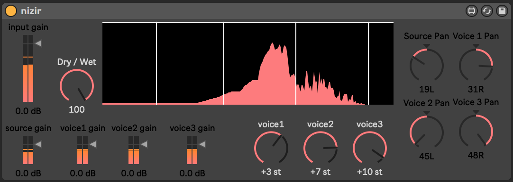

# max-glow

max glow is a collection of max 4 live devices made by me (cashin). these devices have a strong (but not exclusive) focus on electro-acoustic music.

# nizir

takes some audio and adds up to 3 repitched voices on top that can be individually panned to L or R channels. each voice has a range of + or - an octave (12 semitones) and has its own gain, allowing for 2, 3 or 4 voice harmonies.
